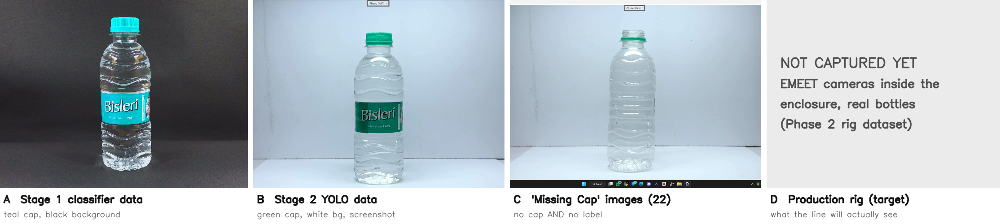

# System Analysis: 3 October 2026

Whole-system review of the codebase, datasets and models against the project goal: one machine-vision
inspection platform that runs the physical conveyor (sensor → camera → AI → decision → PLC → reject).
Every statement is labelled with its evidence level: **FAKE** (software self-test with fake hardware),
**OFFLINE** (model scored on stored images), **REAL-CAMERA** (EMEET frames, no machine) or **PHYSICAL**
(the real machine). Nothing below is PHYSICAL yet.

## 1. What exists

| Layer | Modules | Status | Evidence |
|---|---|---|---|
| Projects / dataset | `dataset.py`, `vision_data.py`, `migrate.py` | working | FAKE + used daily |
| Annotation | `annotation_studio.py`, `stage2_dataset/*` | working | used: 594 images, 1,994 boxes |
| Classification (Stage 1) | `train.py`, `infer.py`, `model_bench.py` | 5 architectures trained | OFFLINE (held-out test) |
| Detection (Stage 2) | `detect.py`, `yolo_stage2_train.py` | YOLOv8n, YOLOv8s trained; v8n "v2" training | OFFLINE |
| Segmentation | `segment.py`, `stage2_dataset/seg_pipeline.py` | interface only, no model | FAKE |
| Decision engine | `decision.py` | working, recipe-driven detection rules | FAKE |
| Machine cycle | `machine_cycle.py` | FIFO, deadlines, PLC commands | FAKE (scan-faithful ladder emulation) |
| PLC | `plc/` | Modbus ASCII, single-owner service | FAKE + simulator reads |
| GUI | `gui.py` (11 tabs incl. Production) | working | FAKE (`gui.py --selftest`) |

## 2. Model results so far (OFFLINE)

Classifier held-out test macro-F1 (`models/MODEL_REGISTRY.json`):

| Architecture | Checkpoint | Test macro-F1 |
|---|---|---|
| EfficientNet-B0 (active) | 20260919-164511 | **0.935** |
| EfficientNet-B1 | 20260919-222031 | 0.845 |
| ResNet18 | 20260920-110121 | 0.773 |
| ConvNeXt-Tiny | 20261003-101425 | 0.764 |
| MobileNetV3-Small | 20260920-102102 | 0.632 |

Detector test mAP50-95: YOLOv8n 0.660, YOLOv8s 0.676. Scored as **defects** through the production
rule (`model_bench.py det-defects`, `models/stage2_yolo/defects_yolov8{n,s}_v1_test.json`):

| Defect (test split, 87 images) | YOLOv8n TP / FN / FP | YOLOv8s TP / FN / FP |
|---|---|---|
| missing_cap | **0 / 12** / 0 | **0 / 12** / 0 |
| missing_label | 35 / 2 / 5 | 35 / 2 / 0 |

The good mAP hides a complete failure on missing caps. The v1 annotations boxed "cap" as cap plus
neck down to the tamper ring (703 of 709 boxes), so the detector learned that a bare neck is a cap.
`stage2_dataset/annotations_v2.py` tightens the cap boxes to the cap itself. A YOLOv8n trained on v2
was in training at the time of writing.

The same failure appears in the integrated check `captures/GT_NOCAP_20261003-134650/result.json`.
The capless test bottle was REJECTED, but only for `missing_label`, not `missing_cap`.

## 3. Main finding: domain shift (Figure `fig_domain_shift.png`)



The models were trained on images that do not look like the machine:

- **A**: Stage 1 classifier data: 250 ml bottle, teal cap, black background.
- **B**: Stage 2 detector data: green cap, white background, desktop screenshots of a phone-webcam app.
- **C**: the 22 "Missing Cap" images: same setup as B, and these bottles have **no label either**,
  so as classifier positives they would teach "no label = missing cap".
- **D**: the production rig (EMEET cameras inside the enclosure, the bottles that will run on the belt).
  None of these images exist yet.

On real EMEET frames of an empty desk, the active classifier gave missing_label ≈ 0.79,
skewed_label ≈ 0.70 and damaged_bottle ≈ 0.65 (REAL-CAMERA,
`captures/NO_BOTTLE_DESK_20261003-134540`). Detection found no bottle, so the decision was FAULT,
not REJECT. That is the correct fail-safe, but it also shows that the classifier's scores mean nothing
outside its training domain.

**Conclusion:** good held-out scores are not evidence for the machine. Production models must be
trained and tested on **rig images**, captured by the EMEET cameras through the enclosure with the
real bottles.

## 4. Machine timing (from measured belt transit)

- Belt end to end ≈ 1460 mm in 15–17 s → **≈ 90 mm/s**.
- A bottle crosses the 330 mm inspection opening in ≈ 3.6 s, about 100 frames at 28 fps, moving
  ≈ 3 mm per frame. Speed is not a vision problem.
- Inspection → reject distance of 300–500 mm gives ≈ 3.3–5.5 s of travel.
- The software sends M1 at `trigger + travel − T0`. The ladder's saved T0 = K150 (15 s) is longer
  than any travel on this belt, so every REJECT would be late. **The ladder needs T0 < travel**
  (contract K15 = 1.5 s). The Production tab now refuses to start with such timings
  (`machine_cycle.timing_problem`).
- The ladder masks triggers while M1 is held (T0 + T1 = 2 s), so bottles must be ≥ ~180 mm apart.

## 5. What makes it a "universal" platform

A new product should need **data, not code**. The workflow that already exists for any product:

1. Create a project (GUI) → images go to `projects/<slug>/images`.
2. Label classes (folders / Label tab) and annotate boxes (Annotate tab).
3. Train and benchmark (Train tab, `model_bench.py`), then deploy one checkpoint explicitly (Use).
4. Calibrate the ROI (`calibrate.py`) and lock the camera (Camera tab).
5. Run production (Production tab): same capture → AI → decision → PLC path for every product.

The part that was still hard-coded for bottles, which component must be where, is now the project's
**inspection recipe** (`config.json` → `"inspection"`, see `decision.py`). The detector reads its
class names from the trained model and refuses a model that lacks a class the recipe needs. Example
for another product:

```json
"inspection": {"anchor": "box",
               "parts": [{"name": "sticker", "search": [0.0, 1.0], "zone": [0.0, 0.5]},
                         {"name": "tag", "required": false}]}
```

→ no sticker = `missing_sticker` (REJECT), sticker in the bottom half = `sticker_misplaced`, no box
at the station = FAULT. Verified in `python decision.py` (FAKE).

## 6. Order of work (machine first)

| Phase | Goal | Done when |
|---|---|---|
| 1 | Mount, light and lock one camera; calibrate ROI | sharp, stable frames; ROI saved |
| 2 | Rig dataset with real bottles (GOOD, NO CAP, NO LABEL, …) | labels.csv holds rig images |
| 3 | Retrain 5 classifiers + 3 YOLO on rig data; defect-level benchmark | missing-cap recall measured on rig test bottles |
| 4 | Real PLC: serial link, X0 → M2, M0/M1, T0/T1 fixed in ISPSoft | `plc.commissioning` passes on hardware |
| 5 | One GOOD + one DEFECT bottle end to end | both correct, PHYSICAL |
| 6 | 10, then 20+ mixed bottles | every bottle accounted for |
| 7 | Second product via recipe, evidence images, polish | new product without code change |

Results from each phase go to `17_Hardware_Commissioning/` and are listed in `../RESULTS_INDEX.md`.
