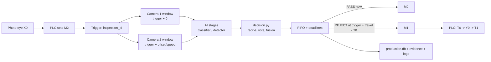

# Bottle Defect Detection System

AI-based bottle inspection for a QC conveyor, built as one Windows desktop application (Python, CustomTkinter,
OpenCV, PyTorch, Ultralytics) that talks to a Delta DVP-SS2 PLC. First application: **250 ml Bisleri bottles**.

> **State (2026-10-05): software prototype ready for physical commissioning, NOT production-validated.**
> Every part of the machine cycle exists in software and passes self-tests with a fake PLC, fake cameras and
> fake models: trigger -> per-bottle inspection -> decision -> time-based FIFO -> PLC command -> history.
> The real PLC has been connected **read-only** (2026-10-04). **No bottle has yet been inspected and rejected
> on the physical machine.** The PLC program still needs changes ([PLC_LADDER_REQUIREMENTS](docs/hardware/PLC_LADDER_REQUIREMENTS.md)),
> and **missing-cap detection is not reliable yet** (see [Missing cap](#missing-cap-the-open-problem)).

| | |
|---|---|
| **Operator screen** | Production page: one machine state, both cameras live, current bottle, counters, alarms, START / STOP / RESET FAULT |
| **Decision** | `decision.py`: recipe-driven, frame vote, camera fusion, FAULT > REJECT > PASS; AI never commands the PLC |
| **Tracking** | Time-based (no encoder): measured belt speed, camera stations, reject deadlines |
| **PLC** | `plc/` Modbus ASCII; M0 = PASS, M1 = REJECT, M2 = trigger; Python never writes Y outputs |
| **Record** | SQLite per project: every bottle, run versions, alarms, evidence images; event logs per subsystem |
| **Models** | Stage 1 classifier (active EfficientNet-B0) + Stage 2 YOLOv8n component detector; registry with gated activation |
| **Docs** | [docs/README.md](docs/README.md) |

## Machine cycle



- One final result per bottle: PASS, REJECT or FAULT. FAULT is physically rejected by default. A REJECT that
  would be late is never fired; the bottle is flagged for removal by hand.
- A bottle sensed at X0 without a trigger (PLC busy) is recorded as NOT INSPECTED, not lost.
- Camera images that cannot be matched to the right bottle by time give `CAMERA_ASSOCIATION_FAULT`.
- Safety: the software HALT latch and an optional E-stop status input stop answering the PLC. **The hardware
  E-stop must cut power on its own.**

## The application (14 pages)

| Group | Pages | Who |
|---|---|---|
| PRODUCTION | **Production**, History (per day / per shift), Health (system status + searchable logs) | operator |
| DATA | Label, Defects, Annotate (boxes, polygons, model proposals, active-learning queues), Data health | engineer |
| MODEL | Train, Analysis, **Models** (CANDIDATE -> VALIDATED -> APPROVED -> ACTIVE, rollback) | engineer |
| ENGINEERING | Live (tuning view), Machine (PLC connection + commissioning), Camera (benchmark + camera lock) | engineer |
| SYSTEM | Settings (text size, light/dark theme, evidence policy, engineer PIN) | engineer |

OPERATOR mode (default) shows only the PRODUCTION group. ENGINEER mode (header button) shows everything, plus the
engineer row on Production: AI task, line cameras, timing, Speed calibration, Line layout / camera stations,
Recipe, the HALT latch and the simulator bottle feed. Tests without the PLC are CAMERA TEST (live images +
quality) and TEST INSPECTION (same models and decision as the line). Guide:
[PRODUCTION_HMI_AND_COMMISSIONING](docs/guides/PRODUCTION_HMI_AND_COMMISSIONING.md).

## Status (honest)

| Area | Software | On the machine |
|---|---|---|
| Per-bottle cycle, FIFO, deadlines, alarms, history | self-tested (fake PLC emulating the decoded ladder) | never run |
| PLC link | simulator-tested | read-only link only (COM5, 9600 7E1) |
| PLC program | `python -m plc.ladder_check`: trigger / handshake / reject cycle present | **T0/T1 = 15 s / 5 s** (should be about 1.5 / 0.5); no E-stop input, M10/M11, interlock, timeout; triggers masked during a reject |
| Time tracking (no encoder) | self-tested; calibration wizard | speed and distances **not measured** |
| Two cameras | staggered stations, association, auto-reconnect | both on one USB 2.0 hub: one 1080p stream only |
| Classifier | held-out test macro-F1 0.935 (active) | not validated on EMEET frames; **`missing_cap` impossible** (0 usable images) |
| Detector | test mAP50 0.968 (v1) | not validated on EMEET frames; **misses full-bottle missing caps** |

Per-feature truth: [FEATURE_STATUS](docs/roadmap/FEATURE_STATUS.md). What exists: [CURRENT_SYSTEM](docs/roadmap/CURRENT_SYSTEM.md).

## Missing cap (the open problem)

All 22 missing-cap images in `All Datasets/Missing Cap` (one unlabelled bottle on a white background) were
already in the detection dataset:

- 10 neck close-ups are in train.
- 12 full-bottle frames were test-only.

Every existing detector reads the green tamper ring of a bare neck as a cap (confidence about 0.70) and misses
all 12. On 2026-10-05:

- **Classifier:** a candidate trained with the 12 images learned "white background = missing cap". It flagged
  25 of 25 *capped* white-background bottles. It is REJECTED, and the images were removed from the classifier
  project (undoable).
- **Detector:** a v3 split moves the full-bottle missing-cap scene into training
  (`stage2_dataset/split_v3.py`), and a YOLOv8n v3 candidate was trained. No missing-cap bottle is left in its
  test set, so it **must be validated on the machine** before activation.
  Result: [models/stage2_yolo/candidate_yolov8n_v3.json](models/stage2_yolo/candidate_yolov8n_v3.json).

**v3 result (2026-10-05, `candidate_yolov8n_v3.json`, `defects_yolov8n_v3_*.json`):** 48 epochs (early stop),
25 min. Box metrics: val mAP50 0.982 / mAP50-95 0.853, test (52 images) mAP50 0.971 / mAP50-95 0.803, cap
test mAP50-95 0.983. Defect level through the production rule:

| Detector | val missing cap (6, same val in v1/v2/v3) | val good pass | test good pass | 12 full-bottle bare necks |
|---|---|---|---|---|
| v1 (`stage2_best.pt`, active) | 0/6 | 54/54 | - | 0/12 (cap ~0.65) |
| v2 | 6/6 | 54/54 | 50/50 (v1 split: 0/12 missing cap) | 0/12 |
| **v3** | 5/6 | 54/54 | 50/50 | 12/12 **(trained on them: not evidence)** |

v3 is the only detector that has learned the full-bottle bare neck. It stays a CANDIDATE: validate it on the
machine with real capped and uncapped bottles, then approve and activate it on the Models page.

- **What is really needed:** missing-cap bottles from several bottles and poses, captured on the machine in the
  production setup (CAMERA TEST -> Capture test frame).

## Setup and run

```bash
# Windows 11, Python 3.8
pip install torch torchvision --index-url https://download.pytorch.org/whl/cu124   # or /cpu
pip install -r requirements.txt
pip install ultralytics==8.1.0 pyserial comtypes psutil

python calibrate.py        # first run: measures the classifier ROI for the active project
python gui.py              # the application (run.bat does the setup and launch)
```

Images, YOLO exports and `*.pt` weights are not in Git; checksums and provenance are in
`models/stage2_yolo/MODEL_PROVENANCE.json` and the candidate records.

Real PLC: close Delta COMMGR first (it holds the COM port). Then Machine page -> Real PLC (serial) -> Connect.
The real PLC is never connected automatically.

## Tests

Every module is its own self-check. These are software tests only; **none is a hardware test**.

```bash
python gui.py --selftest          # all 14 pages + the line against a fake PLC (temp record and logs)
python machine_cycle.py           # full cycle, staggered cameras, association fault, record
python decision.py  tracking.py  machine_state.py  alarms.py  production_store.py  applog.py
python model_registry.py --selftest   autoannotate.py   dataset.py   infer.py   detect.py
python train.py --demo
python -m plc.test_simulation  ;  python -m plc.test_service  ;  python -m plc.ladder_check --selftest
python stage2_dataset/split_v3.py --selftest
```

The full list is in [CLAUDE.md](CLAUDE.md).

## Training (never activates)

- **Classifier:** Train page, or `python train.py --epochs 25 [--arch efficientnet_b0]`. The result is a
  CANDIDATE; `--activate` keeps the old behaviour. Held-out test: `python model_bench.py cls-test <stamp>`.
- **Detector:** `python model_bench.py yolo --model yolov8n.pt --data v3 --workers 0` (v1 / v2 / v3 data).
  Missing-cap score through the production rule: `python model_bench.py det-defects --weights <pt> --tag <t> --split-version v3`.
- **Activation:** Models page. Validate (held-out test + a written real-camera check), then Approve, then
  ACTIVATE. Every activation is logged in `models/deployments.jsonl` and can be rolled back.

## Repository

```
gui.py, hmi.py           the application (Production, Machine, ... / History, Health, Models, dialogs)
machine_cycle.py         trigger -> inspection -> decision -> FIFO -> PLC command
decision.py              the only decision layer (recipe, vote, fusion)
tracking.py              time-based position, camera stations, association, speed calibration
machine_state.py         the one machine state + start checklist
alarms.py, applog.py     coded alarms; structured event logs (logs/)
production_store.py      SQLite record, evidence, shift spans
model_registry.py        model lifecycle and deployment
infer.py, detect.py, segment.py   cameras + classifier, YOLO detector, segmentation interface
dataset.py, train.py, model_bench.py, vision_data.py   data, training, benchmarking
annotate.py, autoannotate.py, annotation_studio.py      annotation + proposals + active learning
plc/                     Modbus ASCII client, PLCService, address map, fake ladder, ladder_check
plc file/final_year/     the user's ISPSoft project (read, never written)
stage2_dataset/          detection dataset provenance (split.json, split_v3.json, annotations_v2.json, ...)
projects/<slug>/         labels.csv, config.json (images, checkpoints, production.db not in Git)
docs/                    roadmap, guides, hardware, audits
```

## Documentation

| | |
|---|---|
| [PRODUCTION_HMI_AND_COMMISSIONING](docs/guides/PRODUCTION_HMI_AND_COMMISSIONING.md) | Operating the line; physical commissioning order |
| [PLC_LADDER_REQUIREMENTS](docs/hardware/PLC_LADDER_REQUIREMENTS.md) | What the PLC program must do, what it already does, rungs to add |
| [GAP_MATRIX_2026-10-05](docs/audit/GAP_MATRIX_2026-10-05.md) | Audit: what was missing, what was built, what remains |
| [CURRENT_SYSTEM](docs/roadmap/CURRENT_SYSTEM.md) / [FEATURE_STATUS](docs/roadmap/FEATURE_STATUS.md) | What exists / per-feature truth |
| [PLC_COMMUNICATION](docs/roadmap/PLC_COMMUNICATION.md) | PLC contract, decoded ladder, simulator measurements |
| [VISION_DATASET](docs/roadmap/VISION_DATASET.md) | Datasets, including the missing-cap finding |
| [TAB_GUIDE](docs/guides/TAB_GUIDE.md) | What every page is for |
| [CLAUDE.md](CLAUDE.md) | Developer / agent notes and every rule the code relies on |
