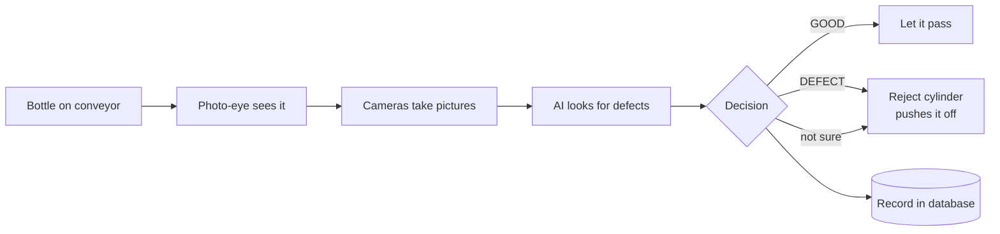
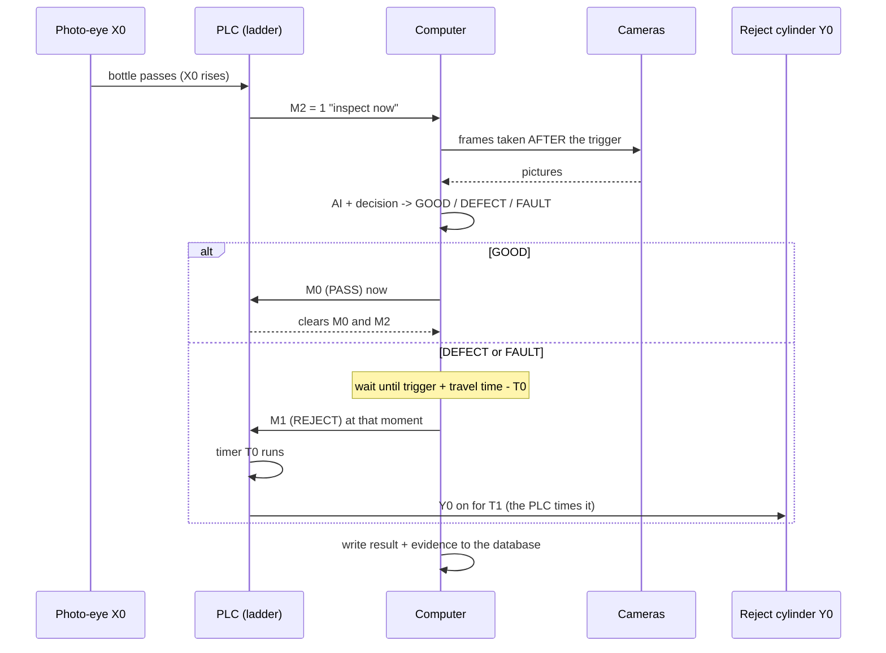
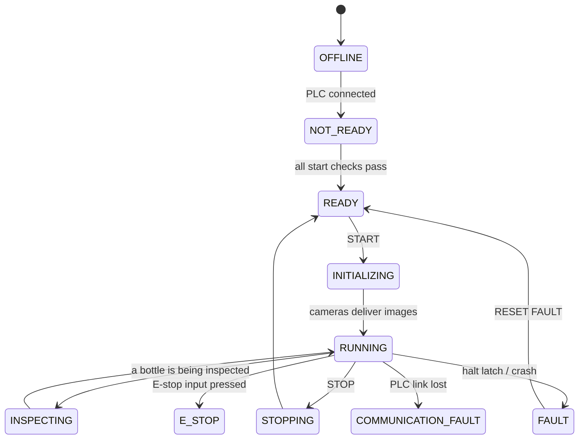
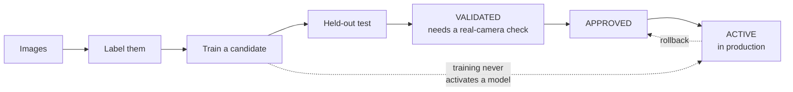

# Bottle Inspection System


**A camera looks at every bottle on a conveyor. If the bottle is bad, a pneumatic cylinder pushes it off the
line. If the system is not sure, it also pushes it off. It never lets an un-inspected bottle through as "good".**

Built for **250 ml Bisleri water bottles** (missing cap, tilted cap, damaged or skewed label, damaged bottle, wrong
water level). It is one Windows desktop application that does everything: label images, train the AI, run the line,
talk to the PLC, and keep a production record.

> **Honest status (2026-10-05).** The whole machine cycle exists in software and passes 24 self-tests using a *fake*
> PLC, *fake* cameras and *fake* models. The real PLC has only been connected **read-only**. **No bottle has yet been
> inspected and rejected on the physical machine.** Missing-cap detection is **not reliable yet**, and the PLC
> program still needs changes. Details: [What works](#what-works-and-what-does-not) - [Missing cap](#the-open-problem-missing-caps).

---

## Start here: pick your path

| I want to... | Go to |
|---|---|
| **See what the project is, in plain words** | [The idea](#the-idea-in-60-seconds) |
| **Run it** | [Quick start](#quick-start) |
| **Operate the line** (operator) | [Operator guide](docs/guides/PRODUCTION_HMI_AND_COMMISSIONING.md) |
| **Commission the machine** (engineer) | [Commissioning order](docs/guides/PRODUCTION_HMI_AND_COMMISSIONING.md) - [PLC ladder requirements](docs/hardware/PLC_LADDER_REQUIREMENTS.md) |
| **Train or improve the AI** | [Model lifecycle](#how-the-ai-gets-better-and-how-it-reaches-production) - [Auto-annotation](docs/guides/AUTO_ANNOTATION.md) |
| **Read the production data** | [Database guide](docs/guides/DATABASE.md) |
| **Know what is done and what is not** | [Feature status](docs/roadmap/FEATURE_STATUS.md) - [Gap matrix](docs/audit/GAP_MATRIX_2026-10-05.md) |
| **Work on the code** | [CLAUDE.md](CLAUDE.md) (every rule the code relies on) - [Repository map](#repository-map) |

---

## The idea in 60 seconds



1. A **photo-eye** (a light beam) notices a bottle and tells the **PLC** (the machine's industrial controller).
2. The PLC tells the **computer** "a bottle is here". The computer takes pictures with its **cameras**.
3. Two kinds of **AI** examine the pictures: a *classifier* (is it tilted? is the label damaged?) and a *detector*
   (where are the bottle, cap and label?). A *missing* cap is found by the detector not finding one on a bottle.
4. A **decision engine** combines the evidence from several frames and cameras into one answer: GOOD, DEFECT, or
   FAULT ("I cannot tell").
5. The computer tells the PLC the answer. The PLC itself fires the **cylinder** at exactly the right moment, when
   that bottle reaches it. The computer never switches the cylinder directly.
6. Everything is written to a **database** so any bottle can be looked up later.

**The golden rule: unknown is never good.** A broken camera, a crashed AI, a stale picture, a bottle nobody could
see: all of these become FAULT, and a FAULT bottle is rejected.

<details>
<summary><b>What the operator actually sees on screen</b></summary>

One answer per bottle, in words: **GOOD**, **DEFECT: Missing cap**, CHECKING, NO BOTTLE or FAULT. It appears once
the system is sure (a few frames) and stays until the bottle has left (`verdict.py`), so it does not flicker.
Component boxes, score bars and detector numbers are hidden; an engineer can turn them on with *Engineer details* on
the Live page.

The Production page shows: one machine state (READY, RUNNING, FAULT ...), both camera feeds, the current bottle,
counters (total / good / defect / fault / not inspected), recent bottles, alarms with what to do, and three big
buttons: **START INSPECTION**, **STOP**, **RESET FAULT**.
</details>

---

## How a bottle travels through the system



<details>
<summary><b>The timing, explained (no encoder on this machine)</b></summary>

There is no encoder, so the position of a bottle is worked out from **time**:

```
travel time   = distance from camera to cylinder / belt speed        (both MEASURED, never assumed)
M1 is sent at = trigger time + travel time - T0                      (T0 = the PLC's delay timer)
Y0 fires at   = trigger time + travel time                           (the bottle is at the cylinder)
```

- The belt speed is measured with the **Speed calibration** wizard (at least 3 timed runs; refused if they vary more
  than 10 %).
- A second camera on the opposite wall, further along the belt, is supported: its pictures are taken at
  `trigger + offset / speed`. If two bottles are too close for the system to tell them apart, it says
  `CAMERA_ASSOCIATION_FAULT` instead of judging the wrong bottle.
- If a reject would be **too late** it is *not* fired (it would hit the wrong bottle): the bottle is marked FAULT and
  an alarm tells the operator to remove it by hand.
- A bottle that arrives while the PLC is busy is counted as **NOT INSPECTED**, never lost silently.
- The system refuses to START if the timing makes every reject late (for example the PLC's T0 is 15 s but the belt
  takes 4 s).
</details>

---

## Quick start

```bash
# Windows 11, Python 3.8
pip install torch torchvision --index-url https://download.pytorch.org/whl/cu124   # or /cpu
pip install -r requirements.txt
pip install ultralytics==8.1.0 pyserial comtypes psutil

python calibrate.py        # first run only: measures where the bottle is in the picture
python gui.py              # the application   (run.bat does all of the above on Windows)
```

Images and trained weights are **not** in Git. A fresh clone needs your own images; checksums of the weights are in
`models/stage2_yolo/MODEL_PROVENANCE.json`.

<details>
<summary><b>First run: what to click</b></summary>

1. The app opens in **OPERATOR mode** on the Production page. Nothing connects or starts by itself.
2. Click **OPERATOR MODE** (top right) to switch to **ENGINEER mode**.
3. **Machine** page -> choose *Simulator (TCP)* or *Real PLC (serial)* -> **Connect**.
   For the real PLC close Delta COMMGR first (it holds the COM port).
4. **Production** page: choose the camera(s), check the timing row (T0 and T1 must equal the PLC's real values), then
   read the **START CHECKS** list. When the banner says **READY**, press **START INSPECTION**.
5. No hardware? Use **CAMERA TEST** (live images and image quality) or **TEST INSPECTION** (same AI and decision as the
   line, no PLC), or **Simulation check** (below).
</details>

---

## The application (15 pages)

| Group | Pages | Who |
|---|---|---|
| **PRODUCTION** | **Production** (the operator screen) - **History** (per day or shift) - **Database** (tables, CSV/report export) - **Health** (computer, PLC, cameras, models, storage, searchable logs) | operator |
| **DATA** | Label - Defects - Annotate (boxes, model proposals, active-learning queues) - Data health | engineer |
| **MODEL** | Train - Analysis - **Models** (the model registry) | engineer |
| **ENGINEERING** | Live (tuning view) - Machine (PLC connection and test) - Camera (benchmark and lock) | engineer |
| **SYSTEM** | Settings (text size, light/dark theme, evidence images, engineer PIN) | engineer |

Every page scrolls up/down and left/right when its content is bigger than the window.

<details>
<summary><b>Operator mode vs engineer mode</b></summary>

**OPERATOR** (the default) shows only the PRODUCTION group. **ENGINEER** (header button, optional PIN in Settings)
shows every page and adds the engineer row on Production: AI task, line cameras, timing, *Speed calibration*,
*Line layout / camera stations*, *Recipe*, *Simulation check*, the HALT latch and the simulator bottle feed.
Nothing is deleted in operator mode, only hidden.
</details>

<details>
<summary><b>The machine states (one source of truth)</b></summary>



The banner on the Production page and the LINE lamp in the status bar always show the *same* state
(`machine_state.py`). START is enabled only in READY: PLC connected, PLC in RUN, cameras chosen, models present,
timing valid, E-stop released, recipe valid.
</details>

---

## How the AI gets better, and how it reaches production



**Training never replaces the production model.** A new model is a CANDIDATE. To become ACTIVE it must pass a
held-out test, be checked on a real camera (written note), be approved, and then activated on the **Models** page.
Every activation is logged and can be rolled back.

<details>
<summary><b>The two AI models, in plain words</b></summary>

| | Classifier (Stage 1) | Detector (Stage 2) |
|---|---|---|
| Model | EfficientNet-B0 (also B1, ResNet18, MobileNetV3, ConvNeXt) | YOLOv8n |
| Looks at | A cropped, standard-size view of the bottle | The whole picture |
| Answers | "How likely is each defect?" (tilted cap, damaged label, wrong water level ...) | "Where are the bottle, cap and label?" |
| Missing cap | cannot learn it yet (no usable images) | a bottle with **no cap box** = missing cap, decided by the **recipe** |
| Why two | The classifier sees subtle shape / print problems; the detector sees whether a part is *there*. |

A *recipe* (`config.json` -> `inspection`, editable in the app) says what a complete product is: the main object
(bottle) and the parts that must belong to it (cap near the top, label in the middle). A new product needs images, a
detector and a recipe, not new code.
</details>

<details>
<summary><b>Why a good bottle can still be called defective (and what to do about it)</b></summary>

On the held-out test set the active classifier calls **10 of 19 good bottles defective**, because it learned from only
72 good bottles. Choosing better thresholds (`python calibrate_thresholds.py`) removes some false alarms but lets 1 of
219 defective bottles through, so it cannot fix the problem. What helps:

- **More good bottles**, photographed in the real enclosure (Live page -> *Capture frame*).
- **One steady answer per bottle** instead of per-frame scores (done: `verdict.py`).
- **Retraining** with those images, then validating on the real camera.

Undo the threshold change any time with `python calibrate_thresholds.py --restore`.
</details>

<details>
<summary><b>Auto-annotation: let the model label images, a person approves</b></summary>

Train on a small set, let the model *propose* labels for the rest, then review the proposals, most doubtful first.
A proposal is **never** training data until a person accepts it. The Annotate page has queues for *least sure*,
*missing part* (a bottle with no cap: likely a real defect) and *doubtful part* (a cap proposed at medium
confidence: a hard negative). Full guide with sources: [AUTO_ANNOTATION](docs/guides/AUTO_ANNOTATION.md).
</details>

---

## The open problem: missing caps

<details open>
<summary><b>What is known (2026-10-05)</b></summary>

The 22 missing-cap pictures (one unlabelled bottle on a *white* background) were already in the detection dataset:
10 neck close-ups in training and 12 full-bottle shots only in the test set. So no detector had learned a bare neck
at full-bottle size, and the existing detectors read the green tamper ring as a cap (confidence about 0.70).

| Detector | Missing cap on validation (6) | Good bottles passed | The 12 bare-neck bottles |
|---|---|---|---|
| v1 (`stage2_best.pt`, **active**) | 0 / 6 | 54 / 54 | 0 / 12 |
| v2 | 6 / 6 | 54 / 54 | 0 / 12 |
| **v3** (new candidate) | 5 / 6 | 54 / 54 | 12 / 12 *(it trained on them: not proof)* |

- **Detector v3** moves the full-bottle scene into training (`stage2_dataset/split_v3.py`). It is a CANDIDATE:
  its test set has no missing-cap bottle left, so it **must be validated on the real machine**.
- **Classifier:** a model trained on these images learned *"white background = missing cap"* (it flagged 25 of 25
  *capped* white-background bottles). It was rejected. Adding them to the classifier project teaches the same
  mistake, so keep them for the detector only.
- **What is really needed:** missing-cap bottles from several bottles and poses, photographed in the production
  setup (black enclosure, real labels).
</details>

---

## What works, and what does not

| Area | In software (fake PLC / cameras) | On the physical machine |
|---|---|---|
| Per-bottle cycle, FIFO, reject timing, alarms, history | works, self-tested | **never run** |
| PLC link | simulator-tested | read-only link only (COM5, 9600 7E1) |
| PLC program | trigger, handshake, reject cycle present | **T0/T1 = 15 s / 5 s** (should be about 1.5 / 0.5); no E-stop input, no answer timeout; triggers masked during a reject |
| Belt speed and distances | calibration wizard works | **not measured yet** |
| Two cameras | staggered stations, association, auto-reconnect | both on one USB 2.0 hub: only one 1080p stream |
| Classifier | test macro-F1 0.935 | not validated on the EMEET cameras; cannot detect missing caps |
| Detector | test mAP50 0.968 (v1) | not validated on the EMEET cameras; misses full-bottle missing caps |

Per-feature truth: [FEATURE_STATUS](docs/roadmap/FEATURE_STATUS.md). Everything above marked *works* is a **software
test with fakes, not a hardware test.**

---

## Check the PLC program and the code (engineer tool)

**Production -> engineer row -> Simulation check...** answers *"is it the ladder or the code?"* with no hardware:

1. **Check the LADDER** runs your real `final_year.isp` in a scan simulator against 14 scenarios of what the software
   needs: PASS / LIMIT (works, known limit) / WARN (unsafe) / FAIL.
2. **Check the SOFTWARE** runs every module self-test.
3. **Read the connected PLC** shows the live bits of the simulator *or* the real PLC (read-only).

<details>
<summary><b>What it says about the current ladder</b></summary>

The ladder **structure is correct** (trigger, PASS answer, REJECT answer, one clean Y0 pulse, conveyor start/stop all
pass). Its **timer presets are wrong for this software** (Y0 fires 15 s after the reject command and stays on 5 s).
Also: no E-stop input, no reject interlock with the conveyor, no timeout if the PC stops answering, and a bottle that
arrives during a reject cycle gets no trigger (the software records it as NOT INSPECTED). The fix list, rung by
rung: [PLC_LADDER_REQUIREMENTS](docs/hardware/PLC_LADDER_REQUIREMENTS.md). Command line:
`python -m plc.ladder_check` and `python -m plc.ladder_sim`. The ladder file is **never** edited by this project.
</details>

---

## The database

SQLite, one file per product: `projects/<project>/production/production.db`. No server, no install, copy the file to
back it up. Three tables: **runs** (each START: job, product, models, recipe, simulator or real PLC), **inspections**
(one row per bottle: result, defects, confidence, what the PLC did, timings, evidence picture) and **alarms**.
Rows are only ever added. The **Database** page shows them in plain words and exports **CSV (opens in Excel)** or a
printable **production report**. Full guide: [DATABASE](docs/guides/DATABASE.md).

---

## Safety design (the rules the code never breaks)

- **Unknown is FAULT, never PASS** - and a FAULT bottle is rejected by default.
- **The AI never commands the PLC.** Only the decision engine does, and only through one owner of the PLC link.
- **Python writes only M0 (PASS) and M1 (REJECT)** (plus opt-in commissioning bits). It never writes the outputs: the
  PLC owns the conveyor, the delay and the cylinder.
- **One answer per trigger, never retried**, and the trigger is marked answered *before* the write.
- **A late reject is never fired.**
- **The real PLC never connects automatically**; physical test commands need engineer mode, test mode and an arm
  click.
- The software **HALT latch** and E-stop *status* input only stop the program from answering. **The hardware E-stop
  must cut power by itself.**

---

## Repository map

<details>
<summary><b>Where things are</b></summary>

```
gui.py, hmi.py           the application (all pages and dialogs)
machine_cycle.py         trigger -> inspection -> decision -> FIFO -> PLC command
decision.py              the only decision layer (recipe, frame vote, camera fusion)
verdict.py               one stable GOOD / DEFECT per bottle for the screens
tracking.py              time-based position, camera stations, speed calibration
machine_state.py         the one machine state + start checklist
alarms.py, applog.py     coded alarms; event logs per subsystem (logs/)
production_store.py      SQLite record, evidence pictures, shifts
production_export.py     database rows in words, CSV, printable report
model_registry.py        model lifecycle, activation, rollback
calibrate_thresholds.py  decision thresholds from validation scores
infer.py, detect.py, segment.py        cameras + classifier, YOLO detector, segmentation interface
dataset.py, train.py, model_bench.py   data, training, benchmarking
annotate.py, autoannotate.py, annotation_studio.py   annotation, model proposals, active learning
selfcheck.py             every self-test in one command
plc/                     Modbus ASCII client, PLC service, fake ladder, ladder_check, ladder_sim
plc file/final_year/     your ISPSoft project (read only)
stage2_dataset/          detection dataset provenance (annotations, splits v1 / v2 / v3)
projects/<slug>/         labels.csv, config.json (images, models, production.db are not in Git)
docs/                    guides, hardware, roadmap, audits
```
</details>

---

## Tests

Every module is its own self-check. **None is a hardware test.**

```bash
python selfcheck.py            # quick set, about 2 minutes: decision, machine cycle, PLC, ladder, verdict, database ...
python selfcheck.py --full     # + dataset, training maths, inference, detector, and the whole GUI
python -m plc.ladder_sim       # your real ladder vs the software contract
```

<details>
<summary><b>Train, evaluate, activate</b></summary>

```bash
python train.py --epochs 25 --arch efficientnet_b0                  # a CANDIDATE; never activates
python model_bench.py cls-test <stamp>                              # held-out test, once
python model_bench.py yolo --model yolov8n.pt --data v3 --workers 0 # detector candidate (v1 / v2 / v3 data)
python model_bench.py det-defects --weights <pt> --tag <t> --split-version v3   # missing-cap score via the real rule
python calibrate_thresholds.py [--apply | --restore]                # thresholds from validation
```

Then **Models** page: Validate (held-out test + a written real-camera check) -> Approve -> ACTIVATE.
On Windows always pass `workers=` to every Ultralytics call (the default exhausts memory on a 16 GB machine).
</details>

---

## Glossary

<details>
<summary><b>Terms used in this project</b></summary>

| Term | Meaning |
|---|---|
| **PLC** | The machine's industrial controller (a Delta DVP-SS2). It runs the conveyor and fires the cylinder. |
| **Ladder** | The PLC's program (ISPSoft). Yours, in `plc file/final_year/`. |
| **X0, M0, M1, M2, Y0, Y1, T0, T1** | PLC devices: X0 photo-eye, M2 "inspect now", M0 PASS answer, M1 REJECT answer, Y0 reject cylinder, Y1 conveyor, T0 delay timer, T1 pulse timer. |
| **Trigger** | The moment a bottle reaches the photo-eye (M2 turns on). |
| **FIFO** | First-in-first-out list of bottles between the camera and the cylinder, each with its own deadline. |
| **Classifier / detector** | The two AI models (see above). |
| **Recipe** | What a complete product looks like (main object and required parts). |
| **FAULT** | "The system cannot vouch for this bottle." Rejected by default. |
| **Candidate** | A trained model that has not been approved for production. |
| **Evidence** | The picture kept for a bottle, by the evidence policy in Settings. |
| **Encoder** | A sensor that measures belt movement. This machine has none, so time is used instead. |
</details>

---

## Documentation

| | |
|---|---|
| [Operate and commission](docs/guides/PRODUCTION_HMI_AND_COMMISSIONING.md) | Operator workflow, timing without an encoder, physical commissioning order |
| [PLC ladder requirements](docs/hardware/PLC_LADDER_REQUIREMENTS.md) | What the PLC program must do, what yours does, the rungs to add |
| [Database](docs/guides/DATABASE.md) - [Auto-annotation](docs/guides/AUTO_ANNOTATION.md) - [Page guide](docs/guides/TAB_GUIDE.md) | Guides |
| [Current system](docs/roadmap/CURRENT_SYSTEM.md) - [Feature status](docs/roadmap/FEATURE_STATUS.md) | What exists, feature by feature |
| [PLC communication](docs/roadmap/PLC_COMMUNICATION.md) - [Hardware](docs/hardware/HARDWARE_INTEGRATION.md) | PLC contract, decoded ladder, camera and line plan |
| [Datasets](docs/roadmap/VISION_DATASET.md) - [Gap matrix](docs/audit/GAP_MATRIX_2026-10-05.md) | Data findings, audit |
| [All docs](docs/README.md) - [CLAUDE.md](CLAUDE.md) | Index; developer notes |
