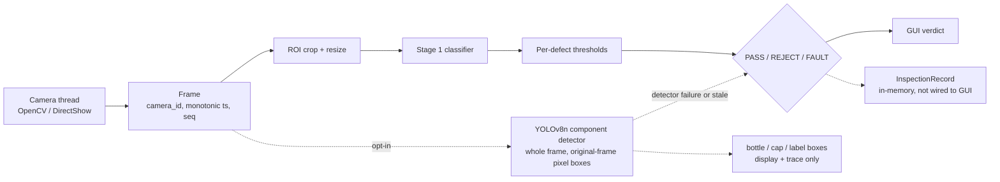
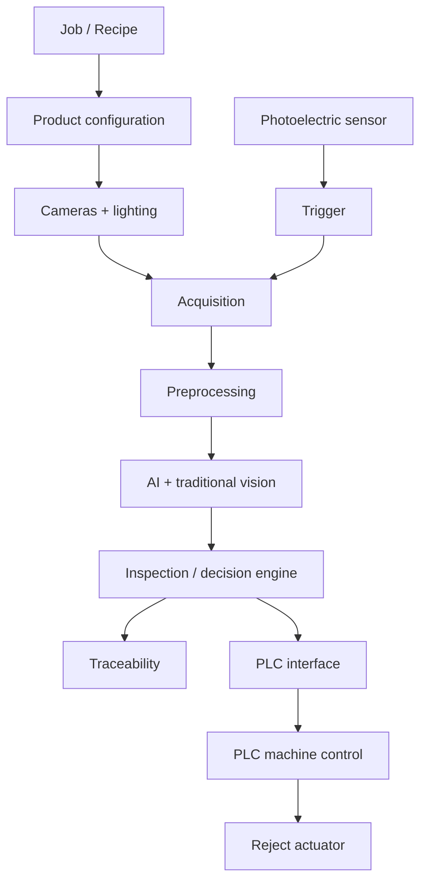

# Bottle Defect Detection System

AI-based bottle defect inspection, being built toward a configurable industrial machine-vision platform. First
application: **250 ml Bisleri bottle inspection on a conveyor**.

> **Current state: a verified software baseline. It has not been connected to, or tested on, a physical
> machine.** No PLC communication, reject control or production deployment exists yet. See
> [What works today](#what-works-today) and [What does NOT work yet](#what-does-not-work-yet).

| | |
|---|---|
| **Stage** | Software baseline; next milestone is the first complete machine cycle |
| **Application** | Python desktop app (Tk / CustomTkinter, OpenCV, PyTorch) |
| **Detector** | YOLOv8n: **training complete** (test-evaluated). **Runtime integration: current development** - opt-in in the Live tab, finds component boxes only |
| **Hardware validation** | None |
| **Docs** | [`SYSTEM_ROADMAP/`](SYSTEM_ROADMAP/README.md) |

## Contents

[Overview](#overview) - [Current state](#current-state) - [Architecture](#architecture) - [Stage 1](#stage-1-classification) -
[Stage 2](#stage-2-detection) - [Safety model](#safety-model-pass--reject--fault) - [Traceability](#traceability) -
[Hardware](#hardware) - [Roadmap](#roadmap) - [Repository](#repository-structure) - [Setup and run](#setup-and-run) -
[Tests](#tests) - [Training](#training) - [Documentation](#documentation) - [Limitations](#known-limitations)

## Overview

**Industrial problem.** Bottles on a filling/packing conveyor must be checked for defects (damaged bottle or
label, missing or tilted cap, skewed label, water level) and bad ones removed - consistently, at line speed,
and without ever passing a bottle the system could not actually inspect.

**System objective.** Camera -> AI inspection -> decision (PASS / REJECT / FAULT) -> PLC -> physical reject.
The governing split: **AI decides *what* the object/defect is; the PLC decides *how* the machine responds.**

**Scope discipline.** The aim is the *minimum reliable machine first*. A larger platform (recipes, database,
dashboard, security, OCR, active learning, ...) is planned but **deliberately deferred** - see
[FUTURE_ENHANCEMENTS](SYSTEM_ROADMAP/FUTURE_ENHANCEMENTS.md).

## Current state

| Area | Status |
|---|---|
| Desktop app, multi-project, labelling, training, annotation | Working (software-tested) |
| Stage 1 multi-label classifier (live path) | Working in software; no held-out test split |
| Stage 2 detection dataset (594 images) | Complete, validated (19/19 export checks) |
| YOLOv8n detector - training | **COMPLETE** (test-evaluated) |
| YOLOv8n detector - runtime | **Current development**: opt-in in the Live tab; bottle/cap/label boxes shown; software-tested; live-tested only on scenes with no bottle |
| PASS / REJECT / FAULT, frame/session metadata | Implemented, software-tested |
| Inspection record / trace store | In-memory foundation only |
| Sensor trigger, tracking, decision rules, timing | Not implemented |
| PLC communication, reject control | Not implemented; PLC I/O mapping **unverified** |
| Physical machine | **NOT TESTED** (no sensor, PLC, conveyor or reject; the only live test used two desktop cameras with no bottle in view) |

### What works today

- Project-based dataset management, labelling GUI, classifier training/evaluation, multi-camera live scoring
  with a PASS / REJECT / FAULT verdict, camera benchmarking and diagnostics.
- Annotation Studio (boxes and polygons) with YOLO export; a reviewed, scene-split Stage 2 dataset.
- A trained YOLOv8n detector with full training provenance
  ([`models/stage2_yolo/MODEL_PROVENANCE.json`](models/stage2_yolo/MODEL_PROVENANCE.json)), and an
  **opt-in runtime path** (`detect.py`; Live tab -> "Classifier + YOLO" / "YOLO only") that draws bottle, cap and
  label boxes with confidences and a detector state, beside the unchanged Stage 1 classifier.
- Fail-safe inspection results (stale/missing/failed -> FAULT) with per-session frame sequence numbers and
  monotonic timestamps; an in-memory inspection record and store.

### What does NOT work yet

- YOLO finds **components, not defects**, and drives no verdict: a missing or low-confidence box is *not* treated
  as a defect (it can be occlusion, angle, blur, lighting or a false negative). "YOLO only" mode reports FAULT by design.
- The detector has not been validated on live bottle frames (the Stage 2 images are Iriun-viewer screenshots, and
  on a bottle-free room it drew low-confidence false boxes at the 0.25 development threshold).
- No bottle tracking / inspection window / temporal voting; no decision rules for detections; no fault latching.
- No sensor trigger, no timing model, no PLC integration (a manual simulator script exists), no reject control.
- No persistence, evidence images, production counters, dashboard, login or reports.
- Nothing has run on the physical machine; PLC addresses are unknown.

### Next milestone

**First complete machine cycle**: a bottle is sensed, inspected, given a PASS / REJECT / FAULT, the PLC receives
the correct result in time, and the correct bottle is physically rejected. YOLO runtime integration is the
**current development** step; the phase after it is **inspection window / per-bottle association** (not PLC).
See [IMPLEMENTATION_PLAN](SYSTEM_ROADMAP/IMPLEMENTATION_PLAN.md).

## Architecture

### Current pipeline (what actually runs)



The detector is **observational**: it never produces PASS or REJECT. If it is enabled and fails or goes stale, the
result becomes FAULT. Details: [CURRENT_SYSTEM](SYSTEM_ROADMAP/CURRENT_SYSTEM.md).

### Target architecture (not implemented)



Details and the software/PLC responsibility split:
[INDUSTRIAL_ARCHITECTURE](SYSTEM_ROADMAP/INDUSTRIAL_ARCHITECTURE.md).

## Stage 1 (classification)

`projects/<slug>/` holds a project: `labels.csv` (one multi-label row per image), `config.json` (ROI, input size,
thresholds, active model) and `models/<stamp>/` checkpoints. The active project `om_bottle` has 1,143 images and
8 defect columns (damaged bottle/label, missing cap/label, skewed bottle/label, tilt cap, water level) with
only 72 "good" examples. Five backbones are supported (EfficientNet-B0/B1, MobileNetV3-Small, ResNet18,
ConvNeXt-Tiny); 9 checkpoints exist.

<details><summary>Caveats</summary>

- Splits are by scene; there is **no held-out test split**.
- Several checkpoints report validation macro-F1 = 1.0 (including a 1-epoch ResNet18), so these scores are
  saturated and are not evidence of production accuracy.
- `missing_cap` has **zero** positive examples and is disabled; `missing_label` has 30 and scored 0 in the
  active model's validation.
- Live thresholds in `projects/om_bottle/config.json` are hand-tuned (some 0.05-0.1) and unvalidated.
</details>

## Stage 2 (detection)

**Dataset** (`stage2_dataset/`): 594 images, 39 scenes, split **by scene**:

| Split | Images | Scenes | bottle | cap | label | Boxes |
|---|---|---|---|---|---|---|
| train | 418 | 25 | 446 | 435 | 350 | 1,231 |
| val | 89 | 7 | 137 | 131 | 99 | 367 |
| test | 87 | 7 | 156 | 143 | 97 | 396 |
| **total** | **594** | **39** | **739** | **709** | **546** | **1,994** |

All images are reviewed; the scene-leakage check passed; the YOLO export passes 19/19 validation checks. The
images and the generated export are not in Git (the scripts, `annotations.json`, `split.json` and manifests are).
The images are 1780x1000 crops of desktop screenshots of the **Iriun Webcam** viewer, not direct OpenCV camera frames.

**Annotation:** the Annotate tab (`annotation_studio.py`, data layer `annotate.py`) supports boxes and
polygons, a reviewed flag and "next unannotated", with YOLO detection/segmentation export. Polygons/segmentation
have not been used on real data.

**YOLOv8n** (`yolo_stage2_train.py`; trained on train only, selected on val, test evaluated once):

| Split | mAP50 | mAP50-95 | Precision | Recall |
|---|---|---|---|---|
| Validation (89) | 0.976 | 0.730 | 0.998 | 0.965 |
| **Test (87, 7 scenes)** | **0.968** | **0.660** | 0.936 | 0.968 |

Per-class test mAP50-95: **bottle 0.816, cap 0.593, label 0.571.** 53 epochs (best epoch 33), 640 px, batch 8,
seed 0, ultralytics 8.1.0, 6.2 MB. GPU batch-1 latency ~29 ms end to end (~34 FPS) on the development laptop's
RTX 3050; CPU ~248 ms.

> **The test set is small** (7 scenes, 87 images, 396 boxes), so these numbers are indicative, not a production
> guarantee. Cap and label are clearly weaker than bottle. The images are Iriun-viewer screenshots, so how the
> detector behaves on live camera frames (the development cameras default to 640x480, 4:3) is unverified.

The full chain *dataset -> annotations -> split -> export -> training configuration -> checkpoint (sha256) ->
validation -> test* is in [`models/stage2_yolo/MODEL_PROVENANCE.json`](models/stage2_yolo/MODEL_PROVENANCE.json).
The weights file is not committed (see below).

## Safety model (PASS / REJECT / FAULT)

`infer.py` produces a tri-state result. **PASS and REJECT only come from a fresh, valid score**; anything else
is FAULT with a reason: camera not started, thread dead, driver error, no model, failed inference, non-finite
scores, nothing scored yet, or a frame/score older than 1.0 s (monotonic clock). With several cameras the
combined result is `FAULT > REJECT > PASS`, and no running camera at all is a FAULT. A FAULT currently clears
itself on the next good frame (no latching yet).

Every frame carries `camera_id`, a per-session sequence number and a `time.monotonic()` stamp; a restarted camera
starts a new session, and a wedged old capture thread cannot write into it. **These are software tests with fake
captures - not hardware tests.**

## Traceability

`inspection_trace.py` provides `InspectionRecord` (id, run id, timestamp, state, decision, camera, session,
frame and result sequence/timestamps, reasons, hits, model id, inference time, project id, job id, evidence
path) and a bounded, thread-safe in-memory `TraceStore`. **In-memory only; no persistence, database or evidence
images; `job_id` and `evidence_path` are placeholders; `decision` currently equals `state`.** Which fields are
populated, and the plan to evolve it: [TRACEABILITY_PLAN](SYSTEM_ROADMAP/TRACEABILITY_PLAN.md).

## Hardware

Intended hardware (as described by the project owner; **none verified from this repository**): conveyor, two
EMEET NOVA 4K cameras, photoelectric bottle sensor, Delta DVP-series PLC programmed in ISPSoft, Festo DSNU
cylinder with a 5/2 solenoid valve, controlled LED lighting, an inspection enclosure.

- The repository contains a PLC **simulator script** and an ISPSoft project whose ladder cannot be read here.
  **PLC addresses / I/O mapping are not verified.**
- The reject has to happen inside the time a bottle takes to travel from the sensor/camera to the reject
  position (`distance / conveyor speed`); the whole capture-to-actuator chain must fit inside that. No physical
  values or latencies are recorded yet. See [HARDWARE_INTEGRATION](SYSTEM_ROADMAP/HARDWARE_INTEGRATION.md).

## Roadmap

| Phase | Objective |
|---|---|
| 0 | Git baseline + documentation (this baseline) |
| 1 | **YOLO runtime integration (current development)** |
| 1b | *(next)* Inspection window / per-bottle association = Phase 2 below |
| 2 | Inspection window / per-bottle association |
| 3 | Decision engine |
| 4 | Mock PLC |
| 5 | Camera / sensor timing |
| 6 | Delta PLC |
| 7 | Conveyor + reject |
| 8 | Physical validation |
| 9 | Industrial platform enhancements (recipes, database, dashboard, security, ...) |

Details: [IMPLEMENTATION_PLAN](SYSTEM_ROADMAP/IMPLEMENTATION_PLAN.md). Deferred features (SQLite, dashboard,
login, OCR/barcode, auto annotation, active learning, anomaly detection, reports, ...):
[FUTURE_ENHANCEMENTS](SYSTEM_ROADMAP/FUTURE_ENHANCEMENTS.md). They are postponed, not abandoned.

## Repository structure

```
gui.py                  desktop app (9 tabs); entry point
dataset.py              project paths, labels.csv, crop pipeline, scene split
train.py                Stage 1 classifier training
infer.py                cameras, model, PASS/REJECT/FAULT, frame metadata, optional detector hook
detect.py               YOLOv8n component detector runtime (Detection / DetectionResult contract)
inspection_trace.py     InspectionRecord + TraceStore (in-memory)
annotate.py             annotation data layer + YOLO export
annotation_studio.py    Annotate tab (boxes/polygons)
bench.py, calibrate.py, charts.py, migrate.py   benchmarking, ROI calibration, charts, layout migration
yolo_stage2_train.py    Stage 2 YOLOv8 training / evaluation / benchmark
yolo_train.py           older synthetic YOLO smoke test (not the real training)
stage2_dataset/         Stage 2 scripts, annotations.json, split.json, manifests, reports, data.yaml
                        (images + generated export are NOT in Git)
models/stage2_yolo/     MODEL_PROVENANCE.json, training_metadata.json, results, curves (weights NOT in Git)
projects/<slug>/        labels.csv, config.json, project.json (images and checkpoints NOT in Git)
plc file/               PLC simulator script + ISPSoft project (ladder unreadable here)
SYSTEM_ROADMAP/         project documentation
FINAL_YEAR_BLACKBOOK/   project write-up
docs/, PLAN.md          original design docs (historical)
app.py, index.html      earlier web version - unused (nothing imports or launches them)
```

## Setup and run

**Data and weights are not in this repository** - images, the generated YOLO export and `*.pt` files are
excluded. A fresh clone cannot reproduce the trained models; it needs your own images (and the weights, whose
checksum is in `MODEL_PROVENANCE.json`).

```bash
# tested: Windows 11, Python 3.8.0
pip install torch torchvision --index-url https://download.pytorch.org/whl/cu124   # or /cpu
pip install -r requirements.txt
pip install ultralytics==8.1.0        # only for the Stage 2 YOLO scripts

python calibrate.py                   # first run only: measures the crop ROI for the active project
python gui.py                         # the desktop application
```

`run.bat` does the above automatically on Windows (detects an NVIDIA GPU, picks the CUDA/CPU wheel).

**YOLO in the Live tab** needs `models/stage2_yolo/stage2_best.pt` (not in Git). It is verified against the sha256 in
`MODEL_PROVENANCE.json` and refused if missing or different - nothing is downloaded. The detector confidence is a
*development threshold* (default 0.25, **not validated for production**); override it in `settings.json` with
`"detector_conf"` (and optionally `"detector_weights"`).

## Tests

Each module is its own self-check (there is no separate suite). Software only - **none is a hardware test**.

```bash
python infer.py                 # tri-state result, freshness, frame metadata, restart safety
python inspection_trace.py      # records, ids, store ordering/bounds/threads, live Camera -> record
python detect.py                # detector parsing/validation (fakes) + real checkpoint sanity check if present
python gui.py --selftest        # builds every tab against the real dataset, no device I/O
python train.py --demo
python dataset.py               # CSV / crop / scene-split correctness
```

Also: `python calibrate.py --demo`, `python charts.py`, `python annotate.py`, `python annotation_studio.py`,
`python stage2_dataset/annotation_workflow.py --selftest`, `python bench.py`, `python migrate.py --demo`.
`stage2_dataset/review_app.py --selftest` is **stale**: it assumes an unreviewed manifest, and the review is
now complete (606 reviewed), so it fails by design.
Stage 2 export validation: `stage2_dataset/validate_yolo_export.py` (19 checks; it writes
`yolo_export/EXPORT_REPORT.md`).

## Training

- **Stage 1:** the Train tab, or `python train.py --epochs 25 [--arch efficientnet_b0]`.
- **Stage 2 YOLO** (needs the Stage 2 images and export, not in Git):
  `python yolo_stage2_train.py --candidates yolov8n.pt --workers 2 --name run`.
  It trains on train only, selects on val, and evaluates test once. **Windows note:** pass `workers` to every
  Ultralytics call (the script does); the default validation workers exhausted memory on a 16 GB machine.
  The YOLOv8n training is complete - do not retrain unless the data or code changes.
- **YOLO evaluation** is recorded in `models/stage2_yolo/training_metadata.json` and `MODEL_PROVENANCE.json`;
  curves are `results.png`, `PR_curve.png` and `confusion_matrix_normalized.png` in `models/stage2_yolo/`.
- Use the portable `stage2_dataset/data.yaml` (pass an absolute path to Ultralytics) on another machine.

## Documentation

| | |
|---|---|
| [SYSTEM_ROADMAP/README.md](SYSTEM_ROADMAP/README.md) | Index |
| [CURRENT_SYSTEM](SYSTEM_ROADMAP/CURRENT_SYSTEM.md) | What exists |
| [CURRENT_SCOPE](SYSTEM_ROADMAP/CURRENT_SCOPE.md) | What is in scope now |
| [FUTURE_ENHANCEMENTS](SYSTEM_ROADMAP/FUTURE_ENHANCEMENTS.md) | What is deferred |
| [INDUSTRIAL_ARCHITECTURE](SYSTEM_ROADMAP/INDUSTRIAL_ARCHITECTURE.md) | Target architecture |
| [IMPLEMENTATION_PLAN](SYSTEM_ROADMAP/IMPLEMENTATION_PLAN.md) | Phased plan |
| [FEATURE_STATUS](SYSTEM_ROADMAP/FEATURE_STATUS.md) | Per-feature status |
| [HARDWARE_INTEGRATION](SYSTEM_ROADMAP/HARDWARE_INTEGRATION.md) | Hardware, timing, unknowns |
| [TRACEABILITY_PLAN](SYSTEM_ROADMAP/TRACEABILITY_PLAN.md) | Records today and later |

Original design doc (historical): [PLAN.md](PLAN.md). Latest audit: [SYSTEM_AUDIT_2026-10-03.md](SYSTEM_AUDIT_2026-10-03.md).
Contributor/agent notes: [CLAUDE.md](CLAUDE.md).

## Known limitations

- No hardware testing; PLC addresses/I-O mapping unverified; no timing or physical values recorded.
- YOLO runtime is in development (opt-in, observational); no tracking, inspection window or decision rules for detections.
- Small, scene-based test set (7 scenes); Stage 1 has no test split and saturated validation scores.
- Camera: driver-default settings, no exposure/focus control, no reconnect or trigger; `time.monotonic()` is
  ~15.6 ms resolution on Windows.
- Inspection records are in-memory only. `gui.py` is large; `app.py`/`index.html` are an unused old web UI.

## Future work

Persistence, dashboard, recipes/jobs, model and dataset registry, security, reports and alarms, traditional
vision, OCR/barcode, annotation automation, active learning, anomaly detection - all
[deferred](SYSTEM_ROADMAP/FUTURE_ENHANCEMENTS.md) until the physical machine is proven.
