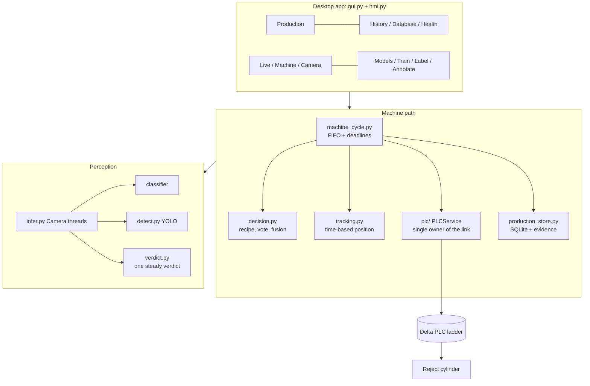

# Team handbook: everything about the Bottle Inspection System

**Who this is for:** a new team member, a reviewer, or an AI assistant (ChatGPT, Claude, ...) who must understand the
whole system without asking anyone. It is self-contained: hardware, technology, features, how it works, how to run
and test it, every setting, current status, known problems and what to do next.

**Status date: 2026-10-06.** Everything is **software-tested with fakes** (fake PLC, fake cameras, fake models).
**The full inspect -> reject cycle has never run on the physical machine.** The only physical contact so far is a
read-only link to the real PLC (2026-10-04).

Related files: `README.md` (front page) - `docs/PROJECT_BRIEF_FOR_REVIEW.md` (status + review questions) -
`CLAUDE.md` (every rule the code relies on) - `docs/roadmap/FEATURE_STATUS.md` (per-feature truth).

## Contents
1. [What the system does](#1-what-the-system-does) - 2. [Hardware](#2-hardware) - 3. [Technology](#3-technology) -
4. [Architecture](#4-architecture) - 5. [A bottle's journey](#5-a-bottles-journey) - 6. [The PLC](#6-the-plc) -
7. [The AI](#7-the-ai) - 8. [Data and files](#8-data-and-files) - 9. [The application](#9-the-application-pages-and-features) -
10. [Settings reference](#10-settings-reference) - 11. [Operations](#11-operations-run-test-train-deploy) -
12. [Safety rules](#12-safety-rules-never-weaken) - 13. [Status](#13-status-what-works-what-does-not) -
14. [Troubleshooting](#14-troubleshooting) - 15. [Next steps](#15-next-steps) - 16. [Glossary](#16-glossary) -
17. [Document map](#17-document-map) - 18. [Using this with an AI assistant](#18-using-this-with-an-ai-assistant)

---

## 1. What the system does

A camera inspects every bottle on a conveyor. Bad bottles, and bottles the system cannot judge, are pushed off the belt
by a pneumatic cylinder. **Unknown is never good.** First product: **250 ml Bisleri water bottles**. Defects:
missing cap, tilted cap, damaged bottle, damaged label, missing label, skewed bottle, skewed label, wrong water level.

It is **one Windows desktop application** that does everything: label images, train the AI, run the line, talk to the
PLC, show one answer per bottle, keep a production record, and manage models.

## 2. Hardware

| Item | Detail (mostly USER-STATED; almost nothing measured) |
|---|---|
| Conveyor | about 5 ft (1524 mm), bottle transit 14-16 s (roughly 95-110 mm/s); **no encoder** |
| Sensor | photoelectric bottle sensor -> PLC input X0 |
| PLC | Delta DVP-SS2, ISPSoft ladder, RS-232 Modbus ASCII 9600 7E1, COM5, station 1 |
| Actuator | Festo DSNU cylinder + 5/2 solenoid valve (PLC output Y0) at the reject station |
| Cameras | 2 x EMEET Nova 4K (USB). On one USB 2.0 hub only **one** 1080p stream works; use separate USB 3 ports |
| Lighting / enclosure | 2 LED strips 6500 K, black matte enclosure 450 x 320 x 400 mm |
| Planned layout | Camera 1 at the photo-eye on one wall; Camera 2 on the opposite wall, shifted toward the exit |
| Computer | Windows 11, Python 3.8, RTX 3050 Laptop GPU (4 GB), 16 GB RAM |

## 3. Technology

| Layer | Choice |
|---|---|
| Language / OS | Python **3.8** (keep `from __future__ import annotations`; no 3.9+ syntax at runtime), Windows 11 |
| UI | CustomTkinter 6.0 (+ plain Tk widgets for per-frame video), Pillow; light industrial theme, dark optional |
| Vision | OpenCV 4.13 (DirectShow cameras, crops, overlays) |
| AI | PyTorch 2.4.1 + CUDA 12.4, torchvision (EfficientNet-B0 and 4 other backbones), **Ultralytics 8.1.0 (YOLOv8n/s)** |
| PLC link | Modbus ASCII over serial (`pyserial`) or TCP (ISPSoft simulator, 127.0.0.1:10002); own protocol code in `plc/` |
| Storage | CSV (`labels.csv`), JSON (configs, provenance), **SQLite** (production record), JPEG (evidence) |
| Charts | drawn on Tk canvas (no matplotlib) |
| Optional | `psutil` (CPU/RAM readings), `comtypes` (camera names), `pynvml` (GPU util) |
| Tests | each module is its own self-test; `python selfcheck.py [--full]` runs all 25 |

`requirements.txt` has the basics; `ultralytics==8.1.0`, `pyserial`, `comtypes`, `psutil` are installed separately.
`run.bat` does setup + launch on Windows.

## 4. Architecture



Key design rules (each has a reason in `CLAUDE.md`):
- **`dataset.py` module globals**: `use_project(name)` rebinds every path; all modules read `D.NAME` at call time.
- **One decision layer** (`decision.py`); AI models never command the PLC.
- **One owner of the PLC link** (`PLCService`); application code never touches `PLCClient`.
- **One machine state** (`machine_state.py`) shown everywhere; **one steady verdict per bottle** (`verdict.py`) for screens.
- **Tk is single-threaded**: background work reports through `App.run_bg` / `App.post`.
- **Configuration over code**: product rules are a recipe (JSON); line timing and layout are settings.

### Module map

| Area | Files |
|---|---|
| Machine cycle, decision, tracking | `machine_cycle.py`, `decision.py`, `tracking.py`, `machine_state.py`, `verdict.py` |
| PLC | `plc/protocol.py`, `address_map.py`, `client.py`, `service.py`, `test_simulation.py` (FakePLC + FakeLadder), `ladder_check.py`, `ladder_sim.py`, `commissioning.py` |
| Perception | `infer.py` (cameras, classifier, overlays), `detect.py` (YOLO runtime), `segment.py` (interface, no model) |
| Training and models | `train.py`, `model_bench.py`, `yolo_stage2_train.py`, `calibrate_thresholds.py`, `model_registry.py`, `model_checks.py` |
| Data and labelling | `dataset.py`, `annotate.py`, `autoannotate.py`, `annotation_studio.py`, `vision_data.py`, `calibrate.py`, `migrate.py` |
| Record and alarms | `production_store.py`, `production_export.py`, `alarms.py`, `applog.py`, `inspection_trace.py` (older, in-memory) |
| App | `gui.py` (~5k lines), `hmi.py`, `theme.py`, `charts.py`, `bench.py` |
| Checks | `selfcheck.py` |
| Data on disk | `projects/<slug>/`, `stage2_dataset/`, `models/`, `plc file/` |

## 5. A bottle's journey

```
X0 (photo-eye) -> PLC ladder sets M2 ("inspect now")
  -> computer takes frames AFTER the trigger from each camera (camera 2 at trigger + offset / belt speed)
  -> AI: classifier (defect scores) + YOLO (bottle / cap / label boxes)
  -> decision.decide(): votes over frames, fuses cameras, applies the recipe -> PASS / REJECT / FAULT
  -> PASS: write M0 now.  REJECT or FAULT: write M1 at (trigger + travel time - T0)
  -> the PLC runs T0, then drives Y0 (cylinder) for T1 by itself
  -> one row per bottle in SQLite + evidence picture + event logs
```

- `travel time = distance(camera -> cylinder) / belt speed`; both are **measured settings** (0 = not measured; then T0 is used).
- **FAULT is rejected by default** (`fault_action`). A REJECT that would be late is never fired; the bottle is FAULT and an
  alarm says to remove it by hand.
- A bottle that reaches X0 while the PLC is busy has no trigger: recorded **NOT INSPECTED** (alarm `BOTTLE_UNTRIGGERED`).
- Two cameras: frames are taken in each camera's own window; if two bottles are too close to tell apart by time the
  camera's evidence is refused (`CAMERA_ASSOCIATION_FAULT`) rather than judging the wrong bottle.
- The screens show **GOOD / DEFECT: <name> / CHECKING / NO BOTTLE / FAULT** (and **CHECK: <defect>?** for unsure bottles);
  the PLC, database internals and code keep PASS / REJECT / FAULT.

## 6. The PLC

| Device | Meaning | Who writes |
|---|---|---|
| X0 | photo-eye | hardware |
| X1 / X2 | start / stop buttons | hardware |
| M2 | "inspect now" trigger | PLC (rising edge of X0) |
| M0 | PASS answer | computer |
| M1 | REJECT answer | computer |
| Y0 | reject cylinder | PLC only |
| Y1 | conveyor motor | PLC only |
| T0 | delay (travel / lead) timer | PLC |
| T1 | reject pulse timer | PLC |
| C0 / C1 | PASS / REJECT counters | PLC |
| M10 / M11 | commissioning start/stop pulses | computer (opt-in `plc_operator_controls`) |

The ladder is the **user's** (`plc file/final_year/final_year.isp`): 7 networks, read and simulated by this project but
**never edited**. Current ladder: structure correct; **T0 = K150 (15 s), T1 = K50 (5 s)** (the software expects about 1.5 s
and 0.5 s); no E-stop input, no Y0/Y1 interlock, no answer timeout, no watchdog; a bottle during a reject cycle gets no
trigger. Full list and the rungs to add: `docs/hardware/PLC_LADDER_REQUIREMENTS.md`.
Check it any time: `python -m plc.ladder_check` (requirements) and `python -m plc.ladder_sim` (14 scenarios).

**Command rules** (never weaken): one answer per trigger; trigger marked answered *before* the write; no retries (an
unknown outcome is reported as `WRITE_FAILED` / `NOT_ACKED` / `ACK_LOST`); preconditions re-read right before the
write; success = the PLC clears the command bit and M2 (M1 is held through the reject cycle); a trigger seen again after
a reconnect is a new trigger flagged `after_reconnect`; Python never writes X or Y devices.

Real PLC connection: close Delta COMMGR first (it keeps the COM port open); the real PLC is **never** connected
automatically; physical test commands need engineer mode + test mode + an arm click.

## 7. The AI

### Models
| | Classifier (Stage 1) | Detector (Stage 2) |
|---|---|---|
| Model | EfficientNet-B0 (also B1, ResNet18, MobileNetV3, ConvNeXt), multi-label, 8 outputs | YOLOv8n (3 classes: bottle, cap, label) |
| Input | ROI crop of the bottle, 192 x 448 (tall, not square) | whole frame |
| Active | checkpoint `20260919-164511` | `models/stage2_yolo/stage2_best.pt` (v1) |
| Missing cap | cannot detect it (no usable positives) | a bottle with **no cap box**, via the recipe |

**Recipe** (`config.json` "inspection", editable in the app): anchor class + parts with `required`, `search`, `zone`. A new
product needs data + detector + recipe, not code.

**Verdict for screens** (`verdict.py`): ignore the first frames, need 6 valid frames, a defect counts if it is in >= 60 %
of them, then **latch** GOOD / DEFECT until the bottle has left; a score just under its threshold in most frames is
**CHECK**; invalid frames -> FAULT, never GOOD. Without a detector (presence unknown) it uses a rolling window.

### Results so far (offline only)
| Measure | Value |
|---|---|
| Classifier held-out test (238 images) | macro-F1 0.935; old thresholds: 10 of 19 good bottles called defective, 0 defective passed |
| After threshold calibration (applied) | 22 false alarms instead of 28, but 1 of 219 defective passed; still 10 of 19 good flagged |
| Detector test mAP50 / mAP50-95 | v1 0.968 / 0.660, v2 0.979 / 0.793, v3 0.971 / 0.803 (v3 test = 52 images) |
| YOLOv8s (v1 data) | 0.973 / 0.676; v2 run unfinished (stopped at epoch 27/80); v3 not trained |
| Missing cap, detector on validation (6) | v1 0/6, v2 6/6, v3 5/6; the 12 full-bottle bare necks: v1 0/12 |

### Model lifecycle (nothing reaches production automatically)
Train -> **CANDIDATE** -> **VALIDATED** (held-out test + real-camera numbers: good called defective <= 2 %, defective
passed <= 1 %, >= 30 + 30 real bottles, and for a classifier the background-shortcut check) -> **APPROVED** -> **ACTIVE**,
with `models/deployments.jsonl` and rollback (`model_registry.py`, `model_checks.py`, Models page).

### Improvement loop
Live **Auto-collect** saves one frame per decided bottle (with the model's guess) into the Label inbox -> you review ->
corrections become **hard examples** -> training draws good bottles up to x5 and hard examples x3 more -> new candidate.
Details: `docs/guides/AUTO_ANNOTATION.md`.

### The open problem: missing caps
The 22 missing-cap pictures are one unlabelled bottle on a *white* background. Detectors read the green tamper ring as a
cap; a classifier trained on them learned "white background = missing cap" (it flagged 25 of 25 *capped* white bottles) and
was rejected. **Keep those images out of classifier training.** Needed: missing-cap bottles from several bottles/poses
photographed in the real enclosure. Detector v3 (missing-cap scene in train) is a CANDIDATE that must be validated on the
real machine.

## 8. Data and files

```
projects/<slug>/            one product: labels.csv, config.json, project.json  (tracked in Git)
  images/{+ve, -ve/<Class>, _inbox}   models/<stamp>/   production/production.db   cache/   trash/   (NOT in Git)
projects/active.txt         which project opens
stage2_dataset/             detection dataset provenance (annotations_v2.json, split.json, split_v3.json, ...); images NOT in Git
models/                     MODEL_REGISTRY.json, deployments.jsonl, stage2_yolo/ (weights NOT in Git)
logs/<channel>.log          app, camera, ai, plc, machine, alarm, production (NOT in Git)
settings.json               machine / UI settings (NOT in Git; per PC)
plc file/final_year/        the PLC project (read only)
```

- `labels.csv` is the **source of truth** (one row per image, one column per defect, `reviewed` flag). Folders only seed a
  label once; unreviewed images are never trained on; model suggestions are never labels until a person accepts.
- **Scene split**: near-duplicate video frames are grouped into scenes and kept whole in train / val / test; the test set
  is only read, never used to choose thresholds or epochs.
- `om_bottle` (classifier): 1,167 images, 8 defects, 72 good. Stage 2 (detector): 594 images, 39 scenes, 1,994 boxes
  (splits v1, v2 tight cap boxes, v3 missing-cap scene in train).
- Label edits are logged and reversible (`label_log.csv`, `trash/`, `dataset.undo`).

## 9. The application: pages and features

15 pages in five groups; every page scrolls up/down and left/right. **OPERATOR** mode (default) shows PRODUCTION only;
**ENGINEER** mode (header button, optional PIN) shows everything.

| Group | Page | What it does |
|---|---|---|
| PRODUCTION | **Production** | one machine state, start checklist, both cameras live, current bottle, counters, alarms; START INSPECTION / STOP / RESET FAULT; CAMERA TEST; TEST INSPECTION (no PLC). Engineer row: AI task, cameras, timing, Speed calibration, Line layout / camera stations, Recipe, Simulation check, HALT latch, simulator feed |
| | History | per day or shift: counts, yield, defect distribution, bottles/hour, alarms, evidence, CSV |
| | Database | bottles / alarms / runs tables, filters, plain-words columns, CSV for Excel, printable report |
| | Health | computer, PLC, cameras, models, storage, alarms; searchable logs |
| DATA | Label | thumbnail grid, multi-label tagging, AI pre-labels, undo, import |
| | Defects | add / rename / delete defect classes |
| | Annotate | boxes and polygons; model proposals; **PREDICTED: GOOD / DEFECT** line; active-learning queues |
| | Data health | class balance, ROI, duplicate / leak warnings |
| MODEL | Train / Analysis | train a CANDIDATE; curves, per-defect results |
| | **Models** | registry: Validate form, Approve, ACTIVATE, Reject, Roll back |
| ENGINEERING | Live | tuning view; one verdict; **Engineer details**; **Auto-collect**; snapshot into a label; thresholds |
| | Machine | PLC connection manager (simulator / real), live X/M/Y/T/C, armed test PASS/REJECT, Simulation check |
| | Camera | measures what each camera mode really delivers; focus / exposure / white balance lock |
| SYSTEM | Settings | text size, theme, evidence policy, auto-activate (off), engineer PIN, Simulation check switch |

**Engineer tools:** *Speed calibration* (>= 3 timed runs, refused if spread > tolerance); *Line layout* (camera stations,
distances, per-camera roles); *Recipe* editor; *Simulation check* (ladder simulation + all self-tests + live PLC read);
*Validate* form (real-camera numbers + shortcut check).

**Machine states:** OFFLINE, NOT_READY, READY, INITIALIZING, RUNNING, INSPECTING, STOPPING, FAULT, E_STOP,
COMMUNICATION_FAULT. START is enabled only in READY (PLC connected and in RUN, cameras chosen, models present, timing
valid, E-stop released, recipe valid).

**Alarms:** 25 coded alarms (severity, message, recommended action), condition or event, RESET FAULT acknowledges.

**Database:** SQLite `projects/<slug>/production/production.db`: `runs` (each START: job, product, models, recipe
fingerprint, SIMULATOR / REAL PLC), `inspections` (one row per bottle), `alarms`. Rows are only added. Guide:
`docs/guides/DATABASE.md`. Evidence pictures follow `evidence_policy`.

## 10. Settings reference

`settings.json` (per PC; the running app rewrites some keys, so **stop the app before editing**). Defaults in brackets.

| Key | Meaning |
|---|---|
| `plc_mode` ["tcp"], `plc_host`, `plc_port` [127.0.0.1:10002], `plc_com`, `plc_baud` [9600], `plc_format` ["7E1"], `plc_station` [1] | PLC link (simulator TCP or real serial) |
| `plc_operator_controls` [false] | enable commissioning buttons (M10/M11 pulses, virtual bottle M2) |
| `plc_t0_s`, `plc_t1_s` | **must equal the ladder's T0 / T1** (default 1.5 / 0.5 s) |
| `inspection_to_reject_mm`, `conveyor_mm_s` [0 = not measured] | travel time = distance / speed |
| `speed_tolerance_pct` [10], `timing_margin_s` [0.15], `speed_calibration` | tracking uncertainty and last calibration record |
| `camera_stations` | `{"<source>": {name, role, offset_mm, side, rules: {station_x, judge}}}` camera positions and roles |
| `line_cameras`, `line_task`, `line_capture_wh` [1920x1080], `line_fourcc` ["MJPG"] | which cameras / AI task / capture mode |
| `inspect_frames` [3], `inspect_window_s` [0.6], `capture_delay_s` [0] | frames per camera per bottle, collection window |
| `reject_tolerance_s` [0.3], `fault_action` ["REJECT"], `fault_latch_after` [3] | late-reject limit, what to do with FAULT, consecutive FAULTs that halt the line |
| `estop_device` ["" or "X3"], `estop_active_high` [false] | optional PLC input wired to the E-stop status |
| `decision_rules` | overrides for `decision.RULES` (`vote`, `det_min_conf`, `check_margin`, ...) |
| `camera_controls` | `{"<index>": {focus, exposure, wb_temperature, rotate}}` locks applied on every open |
| `detector_conf` [0.25], `detector_weights` | YOLO confidence (development value) and weights path |
| `check_margin` [0.10] | score within this margin below a threshold = unsure -> CHECK (0 = off) |
| `evidence_policy` ["REJECT_AND_FAULT"] | NONE / ALL / REJECT_ONLY / FAULT_ONLY / REJECT_AND_FAULT / SAMPLE:n |
| `autocollect_daily_cap` [300] | max auto-collected frames per day |
| `train_balance_good` [true], `train_good_cap` [5], `train_hard_factor` [3] | training sampling |
| `auto_activate_trained_model` [false] | **keep false**: a trained model must pass the registry |
| `activation_gates` | override limits (`max_good_called_defective_pct` 2, `max_defective_passed_pct` 1, `min_real_good` 30, `min_real_defective` 30, `max_shortcut_fire_pct` 10) |
| `critical_classes` [["missing_cap"]] | classes the registry flags if the test set has no positives |
| `job_id`, `product` | typed on the Production page, stored with every run |
| `shifts` | `[["A","06:00","14:00"], ...]` |
| `ui_mode` ["operator"], `ui_theme` ["light"], `engineer_pin`, `font_scale` [1.0], `show_simulation_check` [true] | UI |

Per-project `config.json`: `roi`, `roi_frame`, `input_wh`, `cache_wh`, `thresholds`, `active_model`, `inspection` (recipe),
`thresholds_before_calibration`.

## 11. Operations: run, test, train, deploy

```bash
pip install torch torchvision --index-url https://download.pytorch.org/whl/cu124
pip install -r requirements.txt && pip install ultralytics==8.1.0 pyserial comtypes psutil
python -m vision.calibrate            # first run: measure the classifier ROI
python gui.py                  # the application
```

**Test:** `python selfcheck.py` (quick, ~2 min) or `--full` (25 checks incl. the GUI). `python -m plc.ladder_sim` checks your
ladder. When the GPU/RAM is busy: `set CUDA_VISIBLE_DEVICES=` first.

**Train and deploy a classifier:** `python -m vision.train --epochs 25 --arch efficientnet_b0` (CANDIDATE) ->
`python -m registry.model_bench cls-test <stamp>` (held-out test, once) -> `python -m vision.calibrate_thresholds [--apply|--restore]` ->
Models page: Validate (real-camera numbers + shortcut check) -> Approve -> ACTIVATE (line stopped); Roll back if needed.

**Train a detector:** `python -m registry.model_bench yolo --model yolov8n.pt --data v3 --workers 0` (always pass `workers`; the default
exhausts memory on 16 GB), then `python -m registry.model_bench det-defects --weights <pt> --tag <t> --split-version v3`.

**First physical run (order):** connect PLC read-only -> read T0/T1 in the PLC and fix presets -> photo-eye test ->
cameras on separate USB 3 ports, CAMERA TEST -> Speed calibration -> Line layout -> TEST INSPECTION on known good /
defective bottles -> armed PASS test -> armed REJECT test (cylinder guarded) -> one bottle at a time -> sequential
cameras -> multi-bottle -> latency -> E-stop. Full 16 steps: `docs/guides/PRODUCTION_HMI_AND_COMMISSIONING.md`.

**Git:** work on a branch, open a pull request, merge. Weights, images, `settings.json`, `logs/` are never committed.

## 12. Safety rules (never weaken)

1. Unknown is FAULT, never PASS; a FAULT bottle is rejected by default.
2. The AI never commands the PLC; only the decision engine does, through one `PLCService`.
3. Python writes only M0 / M1 (plus opt-in commissioning bits); never X or Y devices.
4. One answer per trigger; never retried; trigger marked answered before the write.
5. A late reject is never fired.
6. The real PLC never connects automatically; physical test commands need engineer + test mode + arm.
7. The software HALT latch and E-stop status input only stop the program answering the PLC.
   **The hardware E-stop must cut power by itself.**
8. A model never reaches production without the registry gates; training never auto-activates.
9. Model proposals are never labels until a person accepts them.
10. The ladder is the user's: read and simulate it, never edit it.

## 13. Status: what works, what does not

| Area | In software (fakes) | On the machine |
|---|---|---|
| Per-bottle cycle, FIFO, reject timing, alarms, history, database | works, 25 self-tests | **never run** |
| PLC link | simulator-tested | read-only link only |
| PLC program | trigger / handshake / reject cycle present | **T0/T1 = 15 s / 5 s**; no E-stop input, interlock, timeout, watchdog |
| Belt speed, distances, latency | wizard and measurement code work | **not measured** |
| Two cameras | stations, association, auto-reconnect | one USB 2.0 hub: one 1080p stream |
| Classifier | test macro-F1 0.935 | not validated on EMEET frames; cannot detect missing cap |
| Detector | test mAP50 0.968 (v1) | not validated on EMEET frames; misses full-bottle missing caps (v3 candidate may fix) |
| Operator view / database / export / registry gates / auto-collect | works | not used on a line |
| Segmentation | interface only | no model |

## 14. Troubleshooting

| Symptom | Cause / fix |
|---|---|
| "Access is denied" on COM5 | Delta COMMGR holds the port: exit it / delete its driver; one program per port |
| `plc_com` changes by itself | the running app rewrites it from the Machine dropdown; stop the app before editing `settings.json` |
| START stays disabled | read the START CHECKS list; typically T0 (15 s in the ladder vs the settings), no camera chosen, PLC not in RUN |
| Second camera gives no image at 1080p | both on one USB 2.0 hub: separate USB 3 ports (alarm `CAMERA_BANDWIDTH_PROBLEM`) |
| App killed / "paging file is too small" | another job is using RAM / GPU: close it; run tests with `CUDA_VISIBLE_DEVICES=` |
| Good bottle shown as DEFECT | the model is weak on good bottles (72 examples): collect + review + retrain; check `check_margin`; see section 7 |
| Bottle shows NOT INSPECTED | it arrived while the PLC was busy: spacing must exceed the travel time (and T0 + T1 after a reject) |
| Screens look different after an update | text size and theme apply at next start |
| A test wrote into my real data | it must not: tests redirect to temp folders; report it |

## 15. Next steps

1. **Fix the PLC program** (presets K15/K5, E-stop input, Y0 interlock, answer timeout) and upload it from the real PLC to
   compare with the file in the repository.
2. **Hardware day 1:** separate USB 3 ports, measure belt speed and distances, lock camera controls, lighting.
3. **Collect real data** with Auto-collect: many good bottles and missing-cap bottles from several bottles, in the enclosure.
4. **Retrain and validate on the real camera** (gates in section 7); keep the white-background missing-cap images out of
   the classifier.
5. **Physical commissioning** (section 11) and measure latency (trigger -> decision -> command -> cylinder).
6. Later: PLC protocol v2 (several bottles in flight), PC heartbeat watchdog, user login and audit trail, encoder if
   speed varies.

## 16. Glossary

| Term | Meaning |
|---|---|
| PLC / ladder | industrial controller / its program (ISPSoft) |
| Trigger | bottle reaches the photo-eye (M2 on) |
| FIFO | first-in-first-out list of bottles between camera and cylinder, each with a deadline |
| FAULT | "cannot vouch for this bottle"; rejected by default |
| NOT INSPECTED | bottle sensed at X0 but no trigger was possible |
| Recipe | what a complete product looks like (anchor + required parts) |
| Candidate / validated / approved / active | model lifecycle states |
| Hard example | an image where a person corrected the model's pre-label |
| Scene | group of near-duplicate frames of the same bottle, kept whole in a split |
| Evidence | the picture kept for a bottle |
| Encoder | belt-movement sensor; none installed (time is used) |
| ROI | the region of the picture the classifier looks at |

## 17. Document map

| Need | File |
|---|---|
| Front page and quick start | `README.md` |
| This handbook | `docs/TEAM_HANDBOOK.md` |
| Status + 11 review questions | `docs/PROJECT_BRIEF_FOR_REVIEW.md` |
| Rules the code relies on | `CLAUDE.md` |
| Operate and commission | `docs/guides/PRODUCTION_HMI_AND_COMMISSIONING.md` |
| What the PLC must do | `docs/hardware/PLC_LADDER_REQUIREMENTS.md` |
| Database / auto-annotation / pages | `docs/guides/DATABASE.md`, `AUTO_ANNOTATION.md`, `TAB_GUIDE.md` |
| Feature truth, scope, plan | `docs/roadmap/FEATURE_STATUS.md`, `CURRENT_SCOPE.md`, `PROGRESS_PLAN.md`, `FUTURE_ENHANCEMENTS.md` |
| PLC contract and ladder | `docs/roadmap/PLC_COMMUNICATION.md` |
| Datasets and findings | `docs/roadmap/VISION_DATASET.md` |
| Hardware and camera plan | `docs/hardware/HARDWARE_INTEGRATION.md`, `CAMERA_PLACEMENT_AND_LINE_PLAN.md` |
| Audits | `docs/audit/` |

## 18. Using this with an AI assistant

Give it this file (and `docs/PROJECT_BRIEF_FOR_REVIEW.md` for review questions). Tell it: the system is software-tested
only; nothing is validated on the machine; where a value says *not measured* it must say what to measure; and any change
must keep the safety rules in section 12. For code changes also give it `CLAUDE.md`.
